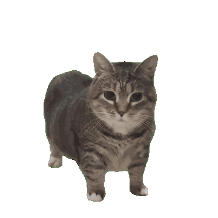
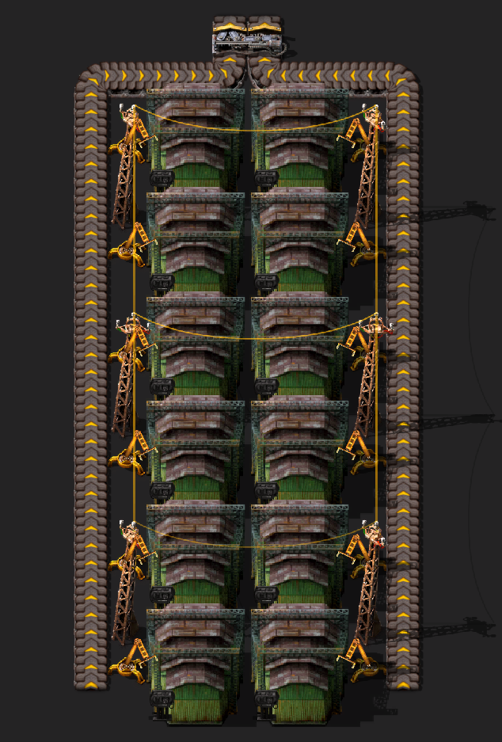
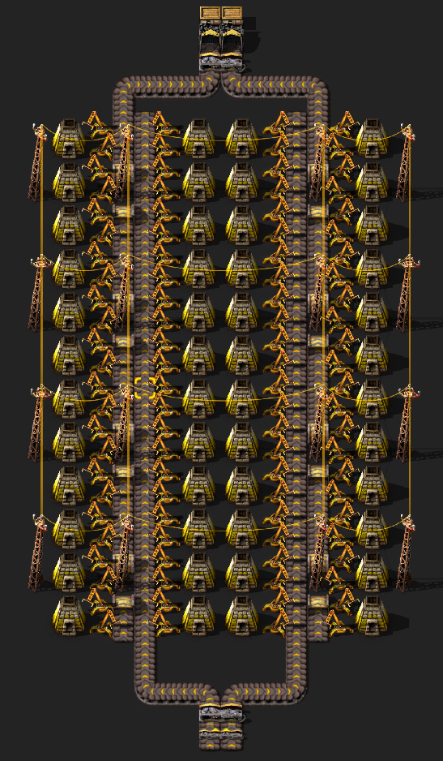
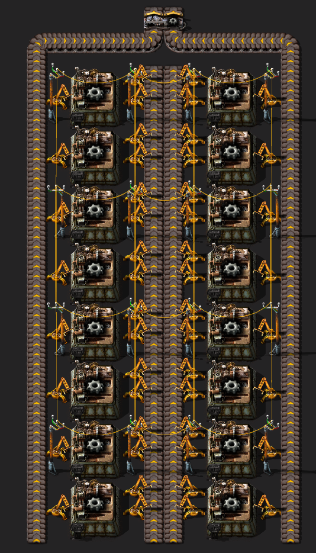
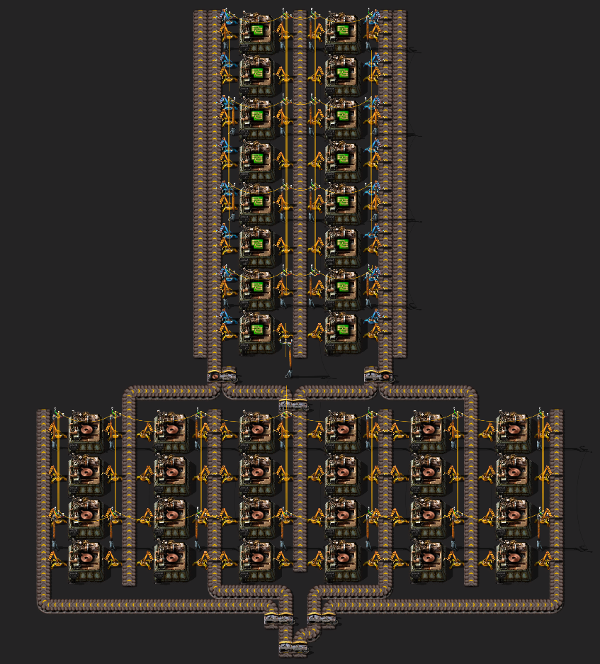

### Start using logseq and maintaining a daily activity log of aal that i do.
- This includes:
	- Games > what i played, how long, explain my creations ( if applicable ) and plans for next time
	  background-color:: blue
	- Learning > Topic of learning (AKA. Programming, Modeling, Animation, etc.)
	  background-color:: blue
	- Work > hours worked, level of exhaustion, how much i spent and anything interesting that happened.
	  background-color:: blue
	- Regular activities > Anything outside of these topics that should probably be recorded for futures sake.
	  background-color:: blue
- {:height 177, :width 168}
- 
- 
- 
- 